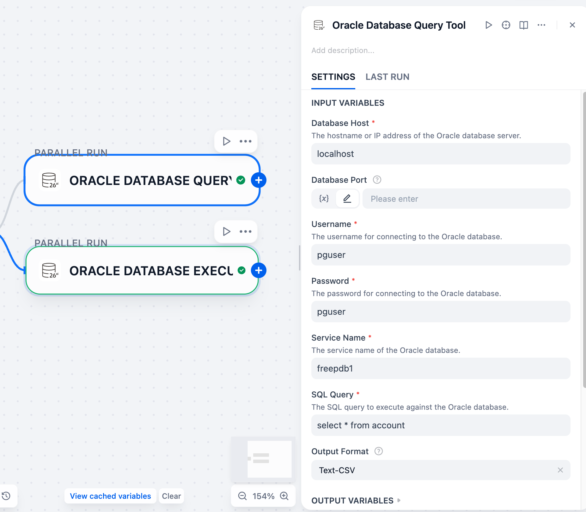

## Oracle AI Database Plugin

**Author:** langgenius
**Version:** 0.0.3
**Type:** tool
**Repo:** [https://github.com/WilburOracle/dify-oracle-db-plugin](https://github.com/WilburOracle/dify-oracle-db-plugin)

### Description

This plugin enables connections to Oracle databases (supporting Oracle Database 26ai and earlier versions) and offers two tools: one for executing SQL queries (e.g., SELECT statements) and another for running SQL commands (such as INSERT, UPDATE, or DELETE operations). It features a streamlined interface that allows direct interaction with Oracle databases within Dify, simplifying database operations for users.

### Features

- Connect to Oracle databases using Thin Mode (no need for Oracle client installation)
- Execute SQL queries and retrieve results in a structured format (JSON, Markdown, CSV)
- Execute SQL statements (INSERT, UPDATE, DELETE) and get execution status
- Support for common Oracle data types
- Error handling and detailed error messages
- Oracle is a converged database, this plugin can execute multi-modal SQL, including relational data queries, property graph data queries, JSON document data queries, vector data queries, etc.

### Parameters

#### Query Tool Parameters

When using the Query tool, you need to provide the following parameters:

| Parameter | Type | Required | Description |
|-----------|------|----------|-------------|
| host | String | Yes | The hostname or IP address of the Oracle database server |
| port | Integer | No | The port number of the Oracle database server (default is 1521) |
| user | String | Yes | The username for connecting to the Oracle database |
| password | String | Yes | The password for connecting to the Oracle database |
| service_name | String | Yes | The service name of the Oracle database |
| query | String | Yes | The SQL query to execute against the Oracle database |
| output_format | String | No | The format of the output (JSON, Text-Markdown, Text-CSV), default is JSON |

#### Execution Tool Parameters

When using the Execution tool, you need to provide the following parameters:

| Parameter | Type | Required | Description |
|-----------|------|----------|-------------|
| host | String | Yes | The hostname or IP address of the Oracle database server |
| port | Integer | No | The port number of the Oracle database server (default is 1521) |
| user | String | Yes | The username for connecting to the Oracle database |
| password | String | Yes | The password for connecting to the Oracle database |
| service_name | String | Yes | The service name of the Oracle database |
| statement | String | Yes | The SQL statement to execute (INSERT, UPDATE, DELETE) |
| output_format | String | No | The format of the output (JSON, Text-Markdown, Text-CSV), default is JSON |

### Example Usage

#### Query Tool Example
Parameters:


When using the Query tool, the plugin returns results in the format you specified (JSON by default) with the following structure:

JSON format:
```json
{
  "text": "",
  "files": [],
  "json": [
    {
      "columns": [
        "NEW_ERPNO",
        "NAME",
        "NEW_PROVINCENAME",
        "NEW_CITYNAME",
        "NEW_COUNTYNAME"
      ],
      "data": [
        {
          "NAME": "张三",
          "NEW_CITYNAME": null,
          "NEW_COUNTYNAME": null,
          "NEW_ERPNO": "1",
          "NEW_PROVINCENAME": null
        },
        {
          "NAME": "李四",
          "NEW_CITYNAME": null,
          "NEW_COUNTYNAME": null,
          "NEW_ERPNO": "2",
          "NEW_PROVINCENAME": null
        },
        {
          "NAME": "王五",
          "NEW_CITYNAME": null,
          "NEW_COUNTYNAME": null,
          "NEW_ERPNO": "3",
          "NEW_PROVINCENAME": null
        },
        {
          "NAME": "赵六",
          "NEW_CITYNAME": null,
          "NEW_COUNTYNAME": null,
          "NEW_ERPNO": "4",
          "NEW_PROVINCENAME": null
        },
        {
          "NAME": "钱七",
          "NEW_CITYNAME": null,
          "NEW_COUNTYNAME": null,
          "NEW_ERPNO": "5",
          "NEW_PROVINCENAME": null
        },
        {
          "NAME": "孙八",
          "NEW_CITYNAME": null,
          "NEW_COUNTYNAME": null,
          "NEW_ERPNO": "6",
          "NEW_PROVINCENAME": null
        },
        {
          "NAME": "周九",
          "NEW_CITYNAME": null,
          "NEW_COUNTYNAME": null,
          "NEW_ERPNO": "7",
          "NEW_PROVINCENAME": null
        },
        {
          "NAME": "吴十",
          "NEW_CITYNAME": null,
          "NEW_COUNTYNAME": null,
          "NEW_ERPNO": "8",
          "NEW_PROVINCENAME": null
        }
      ],
      "message": "Query executed successfully, returned 8 rows.",
      "status": "success"
    }
  ]
}
```

Markdown format: Returns a formatted markdown table with the query results.

CSV format: Returns the raw CSV data of the query results.

#### Execution Tool Example
Parameters:


When using the Execution tool, the plugin returns execution status in the format you specified (JSON by default):

```json
{
  "text": "",
  "files": [],
  "json": [
    {
      "message": "SQL statement executed successfully, affected 1 rows.",
      "row_count": 1,
      "status": "success"
    }
  ]
}
```

#### Error Format

In case of an error, the response will be:

```json
{
  "status": "error",
  "message": "Error description"
}
```

### Version History

#### 0.0.3
- Renamed plugin to Oracle AI Database
- Added new tool to execute SQL statements (INSERT, UPDATE, DELETE)
- Enhanced output format options for query results(JSON, Text-Markdown, Text-CSV)

### 0.0.2
- Change Python version to 3.11.

#### 0.0.1
- Initial version
- Connect to Oracle databases
- Execute SQL queries and retrieve results

### Privacy Note

This plugin only executes SQL and returns results to Dify workflows. It does not actively or passively collect user information.